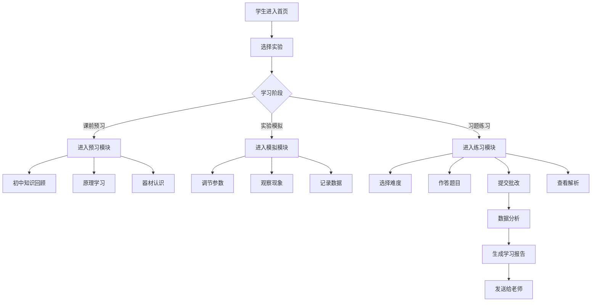

## 1. 产品概述

高中物理实验智能体是一个面向高中生的物理实验学习平台，集课前预习、虚拟实验模拟、高考题练习于一体，帮助学生全方位掌握物理实验知识，提升实验操作能力和应试能力。

- 核心目标：解决高中生物理实验学习痛点，提供从预习到练习的一站式学习体验
- 目标用户：高中学生、物理教师
- 核心价值：通过交互式模拟和智能答题分析，让物理实验学习更直观、更高效

## 2. 核心功能

### 2.1 用户角色
| 角色 | 使用方式 | 核心功能 |
|------|----------|----------|
| 学生用户 | 直接使用 | 预习实验、模拟操作、刷题练习、数据分析 |
| 教师用户 | 接收报告 | 查看学生学习数据报告 |

### 2.2 功能模块
1. **首页导航**：实验列表、三大功能入口、学习进度概览
2. **实验预习模块**：初中物理联系点、实验原理讲解、实验器材介绍
3. **实验模拟模块**：PhET风格交互式虚拟实验、参数调节、实时数据展示
4. **高考题练习模块**：分难度题库、答案检查、错误讲解、错题记录
5. **数据分析模块**：学习数据统计、成绩趋势、一键发送给老师

### 2.3 页面详情
| 页面名称 | 模块名称 | 功能描述 |
|---------|----------|----------|
| 首页 | 实验列表区 | 卡片式展示所有高中物理实验，支持分类筛选 |
| 首页 | 功能导航区 | 三大核心模块入口：预习、模拟、练习 |
| 实验预习页 | 初中联系点 | 展示该实验与初中物理知识的关联点 |
| 实验预习页 | 原理讲解 | 详细讲解实验原理、公式推导、注意事项 |
| 实验预习页 | 器材介绍 | 展示实验所需器材图片、用途、使用方法 |
| 实验模拟页 | 虚拟实验台 | PhET风格交互式模拟，可拖拽操作器材 |
| 实验模拟页 | 参数控制区 | 滑块/按钮调节实验参数，实时观察变化 |
| 实验模拟页 | 数据面板 | 实时显示实验数据、图表绘制 |
| 练习页 | 题目展示 | 显示题目内容、选项，支持选择题/填空题 |
| 练习页 | 答题检查 | 提交后即时判分，显示正确答案 |
| 练习页 | 错误讲解 | 针对错题提供详细解析和知识点讲解 |
| 数据分析页 | 成绩统计 | 正确率、练习次数、难度分布等数据 |
| 数据分析页 | 错题记录 | 错题列表，支持重做和复习 |
| 数据分析页 | 发送老师 | 一键生成学习报告，发送给老师 |

## 3. 核心流程

## 4. 用户界面设计

### 4.1 设计风格
- **设计理念**：科技感教育风格，融合实验室氛围与现代UI美学
- **主色调**：深蓝科技蓝 (#1e3a5f) 搭配 活力橙 (#ff6b35) 作为强调色
- **辅助色**：浅灰蓝背景、青绿色数据可视化色
- **按钮风格**：圆角矩形按钮，悬停时有微交互效果，主按钮使用渐变色
- **字体**：标题使用思源黑体/Noto Sans SC，正文使用易读的无衬线字体
- **布局风格**：卡片式布局，清晰的模块分区，顶部导航栏
- **图标风格**：线性图标配合色彩填充，物理实验相关的图标元素
- **动效**：页面切换平滑过渡，数据变化有数值动画，悬停有微动效

### 4.2 页面设计概览
| 页面名称 | 模块名称 | UI元素 |
|---------|----------|--------|
| 首页 | Hero区域 | 大标题、副标题、三大功能图标卡片、背景渐变 |
| 首页 | 实验列表 | 网格布局卡片、实验图标、难度标签、进度指示 |
| 实验预习页 | Tab导航 | 三个标签页切换：初中联系、原理讲解、器材介绍 |
| 实验预习页 | 内容区 | 图文混排、公式高亮、器材卡片画廊 |
| 实验模拟页 | 模拟画布 | 大面积交互区域、SVG/Canvas绘制实验场景 |
| 实验模拟页 | 控制面板 | 右侧滑出式面板、滑块控件、实时数据面板 |
| 练习页 | 题目卡片 | 题目内容区、选项按钮、进度条、计时器 |
| 练习页 | 解析面板 | 折叠式解析、知识点标签、相关实验链接 |
| 数据分析页 | 数据看板 | 统计卡片、环形图/柱状图、趋势折线图 |
| 数据分析页 | 错题本 | 列表式错题、难度标签、重做按钮 |

### 4.3 响应式设计
- 桌面端优先设计，适配平板和手机端
- 实验模拟区域在移动端自适应缩放
- 导航栏在移动端转为汉堡菜单
- 触控设备优化按钮尺寸和交互区域

### 4.4 实验模拟场景设计
- 采用2D SVG交互式模拟，保证性能和兼容性
- 实验场景：实验台背景、可拖拽的器材、连线/光束等动态元素
- 物理效果：真实的物理运动模拟（弹簧振子、单摆、电路等）
- 数据可视化：实时图表、数值读数、动态曲线
