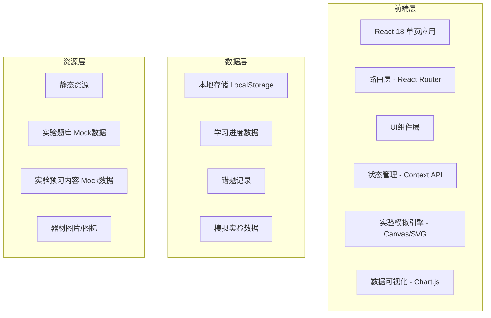

## 1. 架构设计



## 2. 技术说明

- **前端框架**: React 18 + TypeScript
- **构建工具**: Vite
- **样式方案**: TailwindCSS 3
- **路由管理**: React Router v6
- **状态管理**: React Context + useReducer
- **图表库**: Chart.js + react-chartjs-2
- **图标库**: Lucide React
- **实验模拟**: 原生 Canvas API + requestAnimationFrame
- **数据存储**: LocalStorage（前端持久化）
- **后端**: 纯前端应用，无后端，使用Mock数据

## 3. 路由定义

| 路由路径 | 页面名称 | 功能说明 |
|---------|----------|----------|
| `/` | 首页 | 实验列表、功能导航入口 |
| `/experiment/:id` | 实验详情首页 | 实验概览、三大模块入口选择 |
| `/experiment/:id/preview` | 实验预习页 | 初中联系、原理讲解、器材介绍 |
| `/experiment/:id/simulation` | 实验模拟页 | 交互式虚拟实验操作 |
| `/experiment/:id/practice` | 习题练习页 | 高考题练习、答题、批改 |
| `/analysis` | 数据分析页 | 学习数据统计、错题本、发送报告 |

## 4. 数据模型

### 4.1 实验数据模型
```typescript
interface Experiment {
  id: string;
  name: string;
  category: 'mechanics' | 'electromagnetism' | 'optics' | 'thermodynamics' | 'modern';
  difficulty: 'easy' | 'medium' | 'hard';
  description: string;
  icon: string;
  
  // 预习内容
  preview: {
    middleSchoolConnection: string[];  // 初中物理联系点
    principles: {
      title: string;
      content: string;
      formulas?: string[];
      notes?: string[];
    }[];
    equipment: {
      name: string;
      image: string;
      purpose: string;
      usage: string;
    }[];
  };
  
  // 模拟实验配置
  simulation: {
    type: string;
    initialParams: Record<string, number>;
    paramRanges: Record<string, { min: number; max: number; step: number; label: string }>;
  };
}
```

### 4.2 题目数据模型
```typescript
interface Question {
  id: string;
  experimentId: string;
  type: 'single' | 'multiple' | 'fill';  // 单选、多选、填空
  difficulty: 'easy' | 'medium' | 'hard';
  content: string;
  options?: string[];  // 选择题选项
  answer: string | string[];  // 答案
  explanation: string;  // 解析
  knowledgePoints: string[];  // 知识点
}
```

### 4.3 学习记录数据模型
```typescript
interface LearningRecord {
  experimentId: string;
  previewCompleted: boolean;
  simulationCompleted: boolean;
  practiceStats: {
    totalQuestions: number;
    correctCount: number;
    wrongQuestions: string[];  // 错题ID列表
    difficultyStats: Record<string, { total: number; correct: number }>;
  };
  lastStudyTime: string;
}
```

## 5. 核心组件结构

```
src/
├── components/
│   ├── layout/
│   │   ├── Header.tsx          # 顶部导航
│   │   └── Layout.tsx          # 通用布局
│   ├── experiment/
│   │   ├── ExperimentCard.tsx  # 实验卡片
│   │   └── ExperimentList.tsx  # 实验列表
│   ├── preview/
│   │   ├── PreviewTabs.tsx     # 预习标签页
│   │   └── EquipmentCard.tsx   # 器材卡片
│   ├── simulation/
│   │   ├── SimulationCanvas.tsx # 模拟画布
│   │   └── ControlPanel.tsx    # 控制面板
│   ├── practice/
│   │   ├── QuestionCard.tsx    # 题目卡片
│   │   └── ExplanationPanel.tsx # 解析面板
│   └── analysis/
│       ├── StatsCards.tsx      # 统计卡片
│       ├── Charts.tsx          # 图表组件
│       └── WrongList.tsx       # 错题列表
├── pages/
│   ├── Home.tsx
│   ├── ExperimentDetail.tsx
│   ├── Preview.tsx
│   ├── Simulation.tsx
│   ├── Practice.tsx
│   └── Analysis.tsx
├── data/
│   ├── experiments.ts          # 实验Mock数据
│   └── questions.ts            # 题库Mock数据
├── hooks/
│   ├── useLearningRecord.ts    # 学习记录Hook
│   └── useSimulation.ts        # 模拟引擎Hook
├── context/
│   └── LearningContext.tsx     # 学习状态上下文
└── utils/
    └── storage.ts              # 本地存储工具
```

## 6. 实验模拟引擎设计

### 6.1 核心机制
- 使用 Canvas 2D API 绘制实验场景
- requestAnimationFrame 实现60fps动画循环
- 物理计算与渲染分离，保证模拟精度

### 6.2 模拟实验类型
1. **力学类**：弹簧振子、单摆、平抛运动、小车运动等
2. **电磁学类**：电路、电磁感应、变压器等
3. **光学类**：光的折射、双缝干涉等
4. **热学类**：气体压强与体积关系等

### 6.3 交互方式
- 鼠标/触摸拖拽操作器材
- 滑块调节参数（质量、力、电压等）
- 按钮控制实验开始/暂停/重置
- 实时数据读数和图表绘制

## 7. 性能优化策略

- 模拟实验使用 requestAnimationFrame 合理调度
- 图表数据节流更新，避免频繁重绘
- 路由懒加载，按需加载页面组件
- 学习数据批量写入 LocalStorage
- 图片资源使用图标和SVG为主，减少加载时间
